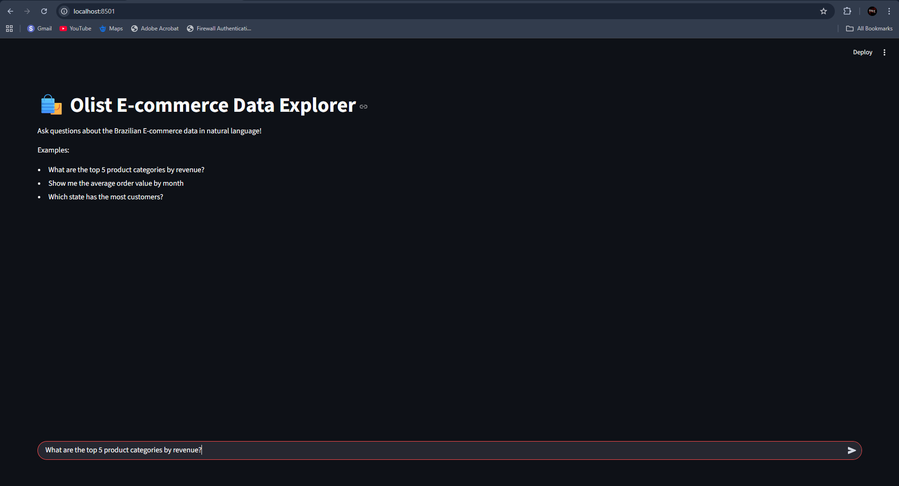

# Maersk GenAI Agent - Olist E-commerce Data Explorer

An intelligent chat interface that allows users to explore and analyze the Olist Brazilian E-commerce dataset using natural language queries.

## 🎯 Features

- Natural language interface to query e-commerce data
- Dynamic SQL/Pandas query generation using LLM
- Interactive visualizations using Plotly
- Conversation memory and context management
- Support for complex analytical queries
- Automatic visualization selection based on data type

## 🛠️ Tech Stack

- **Frontend:** Streamlit
- **Backend:** Python
# Maersk GenAI Agent - Olist E-commerce Data Explorer



An intelligent chat interface that allows users to explore and analyze the Olist Brazilian E-commerce dataset using natural language queries.

## 🎯 Features

- Natural language interface to query e-commerce data
- Dynamic SQL/Pandas query generation using LLM
- Interactive visualizations using Plotly
- Conversation memory and context management
- Support for complex analytical queries
- Automatic visualization selection based on data type

## 🛠️ Tech Stack

- **Frontend:** Streamlit
- **Backend:** Python
- **AI Model:** Google Gemini API
- **Data Processing:** Pandas, SQLite
- **Agent Framework:** LangChain
- **Visualization:** Plotly

## 📦 Installation

1. Clone the repository:
   ```bash
   git clone [your-repo-url]
   cd maersk-genai-agent
   ```

2. Create a virtual environment:
   ```bash
   python -m venv venv
   source venv/bin/activate  # On Windows: venv\Scripts\activate
   ```

3. Install dependencies:
   ```bash
   pip install -r requirements.txt
   ```

4. Set up environment variables:
   - Copy `.env.example` to `.env`
   - Add your Google Gemini API key and other configurations

5. Download the Olist dataset:
   - Download from [Kaggle](https://www.kaggle.com/datasets/olistbr/brazilian-ecommerce)
   - Place the CSV files in the `data/` directory

## 🚀 Usage

1. Start the Streamlit app:
   ```bash
   streamlit run app.py
   ```

2. Open your browser and navigate to http://localhost:8501

3. Start chatting with your data! Try queries like:
   - "What are the top 5 product categories by revenue?"
   - "Show me the average order value by month"
   - "Which state has the most customers?"

## 🧩 Project Structure

```
maersk-genai-agent/
│
├── app.py                     # Streamlit main app (UI)
├── backend/
│   ├── __init__.py
│   ├── agent.py              # LLM + Query agent logic
│   ├── data_handler.py       # Pandas/SQL dataset operations
│   └── utils.py              # Helper functions
│
├── data/                     # Place Olist dataset CSVs here
├── requirements.txt
├── .env                      # API keys configuration
└── README.md
```

## 📝 License

This project is licensed under the MIT License - see the LICENSE file for details.

## 🤝 Contributing

Contributions, issues, and feature requests are welcome! Feel free to check the issues page.